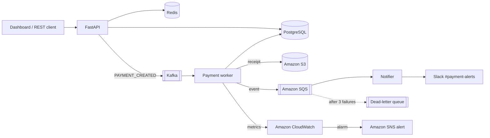

# LedgerFlow — Event-Driven Payment Processing on AWS

LedgerFlow is an event-driven payment processing system built with a focus on reliability, asynchronous processing and cloud integration. A REST API accepts payments, Kafka hands them to a background worker, and the worker moves money with a double-entry ledger. Receipts go to Amazon S3, notifications flow through Amazon SQS to Slack, and metrics and logs go to Amazon CloudWatch. A Jenkins pipeline tests, builds and deploys it to AWS EC2.

**Live demo:** <http://52.66.120.13> · **API docs:** <http://52.66.120.13/docs> (hosted on AWS EC2, ap-south-1)

> Simulation only: no real money, banks or card data are involved.

## Architecture



**What happens to one payment**

1. `POST /payments` validates the request, saves the payment as `PENDING` in PostgreSQL and publishes a `PAYMENT_CREATED` event to Kafka. The API returns `202 Accepted` right away.
2. The **worker** consumes the event, locks the rows, checks the balance and writes two ledger entries (DEBIT the customer, CREDIT the merchant) in one database transaction.
3. For a successful payment, the worker stores a JSON **receipt in S3**.
4. The worker sends an event to **SQS** and publishes `PaymentsSucceeded` / `PaymentsFailed` and processing-time **metrics to CloudWatch**.
5. The **notifier** reads SQS and posts the result to **Slack**. It deletes the message only after Slack accepts it, so if Slack is down the message is retried. After 3 failed attempts it moves to a **dead-letter queue**.
6. A **CloudWatch alarm** fires when 3 or more payments fail within 5 minutes.

## Tech stack

| Area | Tools | Used for |
|---|---|---|
| Backend | Python, FastAPI, SQLAlchemy, Pydantic | REST API, validation, data models |
| Database / cache | PostgreSQL, Redis | Source of truth; short-lived payment status cache |
| Messaging | Kafka, Amazon SQS | Kafka for payment events, SQS for notifications |
| AWS | boto3, S3, SQS, CloudWatch (metrics, logs, alarms), SNS, IAM, EC2 | Storage, queues, monitoring, hosting |
| DevOps | Docker, Docker Compose, Jenkins, LocalStack | Containers, CI/CD, local AWS |
| Integrations | Slack incoming webhooks | Payment alerts in a channel |
| Testing | pytest, moto | API, worker, AWS and Slack behaviour |

## DevOps and cloud

### CI/CD with Jenkins

The [`Jenkinsfile`](Jenkinsfile) defines the pipeline:

```
git push → Jenkins → install deps → pytest → docker build → deploy to EC2 (SSH + deploy.sh) → health check
```

- Test results are published to Jenkins as JUnit reports.
- The deploy stage runs [`deploy.sh`](deploy.sh) on the server. It pulls the code, rebuilds the containers and fails the build if `/health` doesn't respond.
- Jenkins itself runs in Docker: `docker compose -f jenkins/docker-compose.yml up -d --build`, then open <http://localhost:8080>.

### AWS automation with Python (boto3)

No AWS resources are created by hand; two scripts create them:

- [`setup_aws.py`](setup_aws.py) creates the S3 bucket (public access blocked), the SQS queue plus a dead-letter queue, a CloudWatch log group, an SNS alert topic and the CloudWatch alarm. It's idempotent, so running it again changes nothing. Locally it runs against LocalStack automatically on `docker compose up`.
- [`provision_ec2.py`](provision_ec2.py) builds the server: an IAM role, an SSH key pair, a security group, an EC2 instance and an Elastic IP. The server installs Docker on first boot and deploys itself. `python provision_ec2.py destroy` removes the server to stop charges.

### Monitoring (CloudWatch)

| Signal | Where |
|---|---|
| `PaymentsSucceeded`, `PaymentsFailed`, `NotificationsFailed` | CloudWatch metrics, namespace `LedgerFlow` |
| `PaymentProcessingTime` (ms) | CloudWatch metric |
| API, worker and notifier logs | CloudWatch Logs group `/ledgerflow/app` (Docker `awslogs` driver) |
| 3+ failed payments in 5 minutes | CloudWatch alarm → SNS topic `ledgerflow-alerts` |
| Is the app up? | `GET /health` (checks the database), used by `deploy.sh` |

### Security

- The EC2 server gets AWS access through an **IAM role**, so no access keys exist on the server or in the repo.
- The role follows **least privilege**: it only gets `PutObject`/`GetObject` on the one bucket, send/receive/delete on the one queue, metrics limited to the `LedgerFlow` namespace, and writes to the one log group.
- The security group opens HTTP to everyone but **SSH only to the admin's IP**. The server uses IMDSv2.
- The S3 bucket blocks all public access. Secrets such as the database password and Slack webhook live in a `.env` file that is never committed.

## Run locally

Requirements: Docker Desktop.

```bash
cp .env.example .env        # optional: add a Slack webhook URL
docker compose up --build
```

Open <http://localhost:8000> and click **Create demo accounts**, then send a payment. Try an amount larger than the balance to see a `FAILED` payment. Swagger UI is at <http://localhost:8000/docs>.

Everything runs locally, including AWS: LocalStack emulates S3, SQS, CloudWatch and SNS, and `setup_aws.py` provisions them on startup. Without a Slack webhook, the notifier logs the Slack message instead (`docker compose logs notifier`).

### Tests

```bash
pip install -r requirements-dev.txt
pytest -q tests.py
```

The tests use SQLite and **moto**, an in-memory mock of AWS, so they need no Docker or AWS account. They cover:

- account and payment APIs
- successful and failed payments and the double-entry ledger
- Redis fallback
- S3 receipts, SQS messages and CloudWatch metrics
- Slack delivery, including retries when Slack is down
- running the AWS setup script twice

### Slack

In Slack, create an app, enable **Incoming Webhooks**, add a webhook for a channel such as `#payment-alerts` and put the URL in `.env` as `SLACK_WEBHOOK_URL`. Messages look like:

```
❌ Payment FAILED
Payment ID: 118bf6e0-1fb2-46d7-8960-d4ffdd20eba4
Amount: 9000.00 INR
Reason: Insufficient balance
```

## API

| Method | Path | Purpose |
|---|---|---|
| POST | `/accounts` | Create a customer or merchant account |
| GET | `/accounts`, `/accounts/{id}` | List or get accounts |
| POST | `/accounts/{id}/fund` | Add money to an account |
| POST | `/payments` | Create a payment (returns `202` + `PENDING`) |
| GET | `/payments`, `/payments/{id}` | List or get payments |
| GET | `/payments/{id}/ledger` | Double-entry ledger lines for a payment |
| GET | `/payments/{id}/receipt` | Receipt read back from S3 |
| GET | `/notifications` | Notification records and whether they were sent |
| GET | `/health` | Health check (includes a database query) |

## Failure handling

| Failure | Behaviour |
|---|---|
| Insufficient balance | Payment becomes `FAILED`, no balance changes, metric + Slack alert |
| Kafka down when creating a payment | API returns `503`; the payment stays saved as `PENDING` |
| Same Kafka event delivered twice | Ignored once the payment is `SUCCESS`/`FAILED` |
| Redis down | Logged; reads fall back to PostgreSQL |
| S3 or SQS down | Logged; the committed payment is not rolled back |
| Slack down | Message stays in SQS and is retried, then moves to the dead-letter queue |
| CloudWatch down | Metric is skipped; payment processing continues |

## Project structure

```text
app.py               FastAPI app and endpoints
worker.py            Kafka consumer that processes payments
notifier.py          SQS consumer that sends Slack messages
models.py            SQLAlchemy tables: accounts, payments, ledger_entries, notifications
schemas.py           Pydantic request/response models
database.py          Database engine and sessions
kafka_client.py      Kafka producer/consumer
redis_client.py      Payment status cache
aws_services.py      boto3 helpers for S3, SQS and CloudWatch
slack_client.py      Slack webhook client
setup_aws.py         Creates S3 / SQS / CloudWatch / SNS resources
provision_ec2.py     Creates IAM role, security group and EC2 server
deploy.sh            Deploy script run on the server
static/index.html    Dashboard
tests.py             pytest suite
Jenkinsfile          CI/CD pipeline
jenkins/             Jenkins in Docker
docker-compose.yml       Local stack (with LocalStack)
docker-compose.prod.yml  Production stack on EC2 (real AWS)
```

## Limitations and next steps

- One EC2 instance runs everything. In production I'd use managed services (RDS for PostgreSQL, ElastiCache for Redis, MSK for Kafka) and run the app on ECS.
- Jenkins builds the image, but the server also rebuilds it. Pushing a versioned image to Amazon ECR would make deploys faster and rollbacks easy.
- The demo is served over plain HTTP, with no domain or TLS.
- There is no authentication, and no idempotency keys on `POST /payments`.
- Infrastructure is scripted with boto3. Terraform or CloudFormation would add drift detection and plan/apply reviews.
