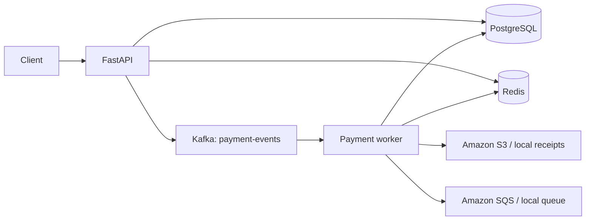
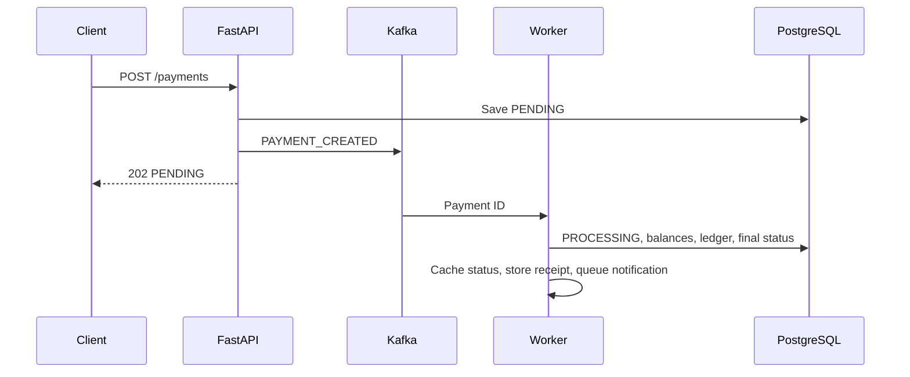

# LedgerFlow — Event-Driven Payment Processing System

LedgerFlow is an event-driven payment processing simulator built with FastAPI, PostgreSQL, Kafka, Redis, Amazon S3, Amazon SQS, and Docker. It accepts payment requests through a REST API and processes them asynchronously while maintaining account balances, ledger entries, receipts, and notification records.

## Features

- Customer and merchant account management
- Decimal-safe balance operations
- Asynchronous payment processing through Kafka
- Transactional balance and ledger updates
- Redis-backed payment status caching
- JSON receipt storage in Amazon S3 or the local filesystem
- Notification delivery through Amazon SQS or a local queue
- Docker Compose environment for local development

## Architecture





## Technology stack

| Technology | Usage |
|---|---|
| FastAPI | HTTP API and validation |
| PostgreSQL | Permanent accounts, payments, ledger, and notifications |
| Kafka | Sends payment-created events to the asynchronous worker |
| Redis | Caches only the latest payment status for 10 minutes |
| Amazon S3 | Stores successful-payment JSON receipts in AWS mode |
| Amazon SQS | Carries notification tasks in AWS mode |
| Docker Compose | Runs the API, worker, PostgreSQL, Redis, and Kafka locally |

PostgreSQL is the source of truth for application data. When AWS integration is disabled, receipts and notification messages are stored locally.

## Files

```text
app.py              FastAPI setup, table creation, and endpoints
database.py         Engine and sessions
models.py           SQLAlchemy data models
schemas.py          Request and response validation
kafka_client.py     Kafka producer and consumer configuration
redis_client.py     Payment-status cache
aws_services.py     S3/SQS and local-mode equivalents
worker.py           Payment processing
seed.py             Sample data setup
tests.py            Automated test suite
docker-compose.yml  Local service configuration
```

## Run locally with Docker

Requirements: Docker with Docker Compose. Copy `.env.example` to configure the application; local storage mode is enabled by default.

```bash
cp .env.example .env
docker compose up --build
```

API: <http://localhost:8000> · Swagger: <http://localhost:8000/docs>

The API and worker connect to PostgreSQL, Redis, and Kafka through the internal Docker network. Database tables are created during application startup with SQLAlchemy's `Base.metadata.create_all()`.

## Usage

Create a funded customer account and a merchant account:

```bash
docker compose exec api python seed.py
```

The script prints both account IDs and a payment request command. Accounts can also be created and funded through the API:

```bash
curl -X POST http://localhost:8000/accounts -H 'Content-Type: application/json' \
  -d '{"name":"Demo Customer","account_type":"CUSTOMER","currency":"INR"}'

curl -X POST http://localhost:8000/accounts/ACCOUNT_ID/fund \
  -H 'Content-Type: application/json' -d '{"amount":"5000.00"}'
```

Create a payment after replacing the account IDs:

```bash
curl -X POST http://localhost:8000/payments -H 'Content-Type: application/json' \
  -d '{"customer_account_id":"CUSTOMER_ID","merchant_account_id":"MERCHANT_ID","amount":"500.00","currency":"INR","description":"Demo purchase"}'
```

Docker Compose starts the worker with the application. It can also be run separately:

```bash
docker compose run --rm worker python worker.py
```

Retrieve the payment, ledger entries, and receipt, then process a queued notification:

```bash
curl http://localhost:8000/payments/PAYMENT_ID
curl http://localhost:8000/payments/PAYMENT_ID/ledger
curl http://localhost:8000/payments/PAYMENT_ID/receipt
curl http://localhost:8000/notifications/process-one
```

Run the test suite inside the application image:

```bash
docker compose run --rm --no-deps api pytest -q tests.py
```

## Environment variables

| Variable | Default / meaning |
|---|---|
| `DATABASE_URL` | PostgreSQL connection URL |
| `REDIS_URL` | Redis connection URL |
| `KAFKA_BOOTSTRAP_SERVERS` | Kafka broker address |
| `USE_AWS` | `false` uses local files; `true` uses S3 and SQS |
| `AWS_REGION` | AWS region, default `ap-south-1` |
| `S3_BUCKET` | Existing receipt bucket name |
| `SQS_QUEUE_URL` | Existing `payflow-notifications` queue URL |

### AWS setup

Create one private S3 bucket and one standard SQS queue named `payflow-notifications`. Give the runtime identity permission for `s3:PutObject`, `s3:GetObject`, `sqs:SendMessage`, `sqs:ReceiveMessage`, and `sqs:DeleteMessage` on only those resources. Set `USE_AWS=true`, the bucket name, queue URL, and region. Boto3 uses the normal AWS credential chain; credentials are never stored in this repository.

With `USE_AWS=false`, receipts go to `receipts/` and notifications to `local_notifications.json`. Neither AWS credentials nor network access to AWS is required.

## API summary

- Accounts: `POST /accounts`, `GET /accounts`, `GET /accounts/{id}`, `POST /accounts/{id}/fund`
- Payments: `POST /payments`, `GET /payments`, `GET /payments/{id}`, `GET /payments/{id}/ledger`, `GET /payments/{id}/receipt`
- Notifications: `GET /notifications`, `GET /notifications/process-one`
- Health: `GET /health`

## Failure handling

- Insufficient funds produces `FAILED` without changing either balance.
- Redis errors are logged and reads fall back to PostgreSQL.
- S3 or SQS errors are logged after the database transaction; payment completion remains valid.
- If Kafka publishing fails, the API returns `503` and identifies the saved `PENDING` payment.
- Duplicate Kafka events are ignored after a payment reaches a terminal status.
- External storage and queue errors do not roll back a completed database transaction.

## Limitations

- The system processes simulated funds and does not integrate with banks, cards, or payment networks.
- Authentication, authorization, idempotency, event deduplication, and an outbox are not implemented.
- Kafka retry topics, a dead-letter queue, schema migrations, and reconciliation jobs are not implemented.
- The local JSON notification queue is intended for single-process development only.

## Security disclaimer

LedgerFlow is a simulation and is not a payment gateway or a PCI-DSS-compliant system. Do not use it to process real financial data or credentials. Keep `.env` files and AWS credentials outside version control.
