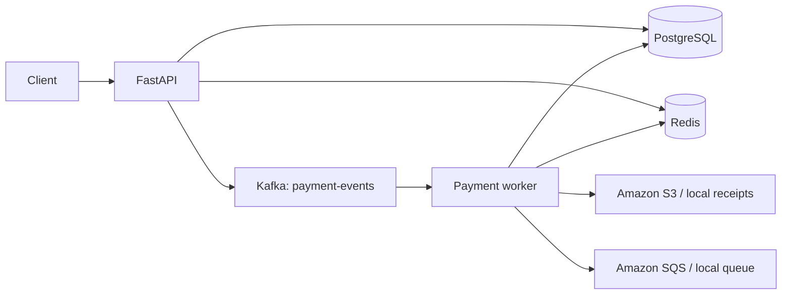
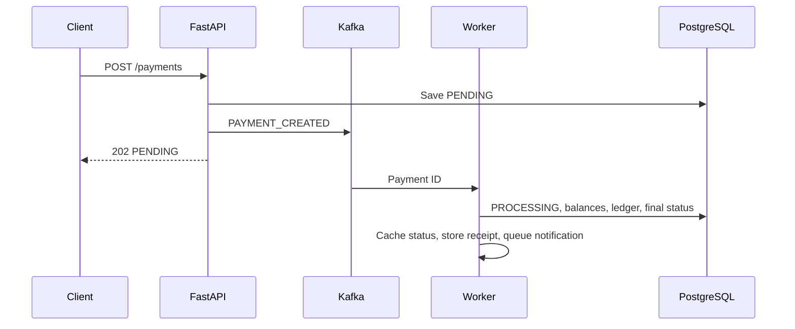

# LedgerFlow — Event-Driven Payment Processing System

LedgerFlow is a small educational payment simulator for demonstrating a REST API, durable data, event-driven processing, caching, cloud object storage, queues, and containers. It never contacts a bank or handles real money.

## Problem and features

A payment can take longer than an HTTP request should. LedgerFlow accepts a request immediately as `PENDING`, then a Kafka worker processes it. It supports customer and merchant accounts, simulated funding, success/failure based on balance, double-entry-style ledger records, cached status, JSON receipts, and queued notifications.

## Architecture





## One purpose per technology

| Technology | Purpose |
|---|---|
| FastAPI | HTTP API and validation |
| PostgreSQL | Permanent accounts, payments, ledger, and notifications |
| Kafka | Sends payment-created events to the asynchronous worker |
| Redis | Caches only the latest payment status for 10 minutes |
| Amazon S3 | Stores successful-payment JSON receipts in AWS mode |
| Amazon SQS | Carries notification tasks in AWS mode |
| Docker Compose | Runs the API, worker, PostgreSQL, Redis, and Kafka locally |

PostgreSQL is always the source of truth. Local mode substitutes a `receipts/` directory and a small JSON queue for AWS, so no credentials are needed.

## Files

```text
app.py              FastAPI setup, table creation, and endpoints
database.py         Engine and sessions
models.py           Four SQLAlchemy tables
schemas.py          Request and response validation
kafka_client.py     One producer and one consumer
redis_client.py     Payment-status cache
aws_services.py     S3/SQS and local-mode equivalents
worker.py           Payment processing
seed.py             Demo data
tests.py            Eight focused tests
docker-compose.yml  Complete local stack
```

## Run locally with Docker

Requirements: Docker with Compose. Copying `.env.example` is optional because local mode is the default.

```bash
cp .env.example .env
docker compose up --build
```

API: <http://localhost:8000> · Swagger: <http://localhost:8000/docs>

The Compose service hostnames (`postgres`, `redis`, and `kafka`) are already configured. Kafka is intentionally not published on host port `9092`; only the API and worker need to reach it through Docker's internal network. `Base.metadata.create_all()` creates the four tables when the API starts; there is intentionally no migration framework.

## Demo

Seed one funded customer and one merchant:

```bash
docker compose exec api python seed.py
```

The script prints both IDs and a ready-to-run payment command. Manual account calls are:

```bash
curl -X POST http://localhost:8000/accounts -H 'Content-Type: application/json' \
  -d '{"name":"Demo Customer","account_type":"CUSTOMER","currency":"INR"}'

curl -X POST http://localhost:8000/accounts/ACCOUNT_ID/fund \
  -H 'Content-Type: application/json' -d '{"amount":"5000.00"}'
```

Create a payment (replace the IDs):

```bash
curl -X POST http://localhost:8000/payments -H 'Content-Type: application/json' \
  -d '{"customer_account_id":"CUSTOMER_ID","merchant_account_id":"MERCHANT_ID","amount":"500.00","currency":"INR","description":"Demo purchase"}'
```

Compose starts the worker automatically. To run it separately:

```bash
docker compose run --rm worker python worker.py
```

Check a payment and process one notification:

```bash
curl http://localhost:8000/payments/PAYMENT_ID
curl http://localhost:8000/payments/PAYMENT_ID/ledger
curl http://localhost:8000/payments/PAYMENT_ID/receipt
curl http://localhost:8000/notifications/process-one
```

Run tests inside the image (tests use SQLite and mocked infrastructure boundaries):

```bash
docker compose run --rm --no-deps api pytest -q tests.py
```

## Environment variables

| Variable | Default / meaning |
|---|---|
| `DATABASE_URL` | PostgreSQL connection URL |
| `REDIS_URL` | Redis connection URL |
| `KAFKA_BOOTSTRAP_SERVERS` | Kafka broker address |
| `USE_AWS` | `false` uses local files; `true` uses S3 and SQS |
| `AWS_REGION` | AWS region, default `ap-south-1` |
| `S3_BUCKET` | Existing receipt bucket name |
| `SQS_QUEUE_URL` | Existing `payflow-notifications` queue URL |

### AWS setup

Create one private S3 bucket and one standard SQS queue named `payflow-notifications`. Give the runtime identity permission for `s3:PutObject`, `s3:GetObject`, `sqs:SendMessage`, `sqs:ReceiveMessage`, and `sqs:DeleteMessage` on only those resources. Set `USE_AWS=true`, the bucket name, queue URL, and region. Boto3 uses the normal AWS credential chain; credentials are never stored in this repository.

With `USE_AWS=false`, receipts go to `receipts/` and notifications to `local_notifications.json`. Neither AWS credentials nor network access to AWS is required.

## API summary

- Accounts: `POST /accounts`, `GET /accounts`, `GET /accounts/{id}`, `POST /accounts/{id}/fund`
- Payments: `POST /payments`, `GET /payments`, `GET /payments/{id}`, `GET /payments/{id}/ledger`, `GET /payments/{id}/receipt`
- Notifications: `GET /notifications`, `GET /notifications/process-one`
- Health: `GET /health`

## Failure behavior and limitations

- Insufficient funds produces `FAILED` without changing either balance.
- Redis errors are logged and reads fall back to PostgreSQL.
- S3 or SQS errors are logged after the database transaction; payment completion remains valid.
- If Kafka publishing fails, the API returns `503` and identifies the saved `PENDING` payment.
- This learning project has no authentication, retries, deduplication, outbox, reconciliation, or concurrency/load claims. A duplicate Kafka delivery arriving before completion could process twice.
- Funding is a simulator endpoint, notification processing is intentionally a GET endpoint per the project scope, and local JSON queue access is not designed for concurrent writers.

Future production work could add authentication, idempotency, an outbox, event deduplication, retry and dead-letter queues, migrations, observability, reconciliation, and stronger failure recovery. Those are deliberately excluded here.

## Security disclaimer

LedgerFlow is not a payment gateway, is not PCI-DSS compliant, and must not be used with real customers, cards, UPI, bank accounts, or money. Never commit `.env` or AWS credentials.

## Resume-ready description

> Built LedgerFlow, an educational event-driven payment simulator using FastAPI, PostgreSQL, Kafka, Redis, Docker, Amazon S3, and Amazon SQS. Implemented asynchronous payment processing, transactional balance and ledger updates, cached status reads, receipt storage, and queued notifications.
